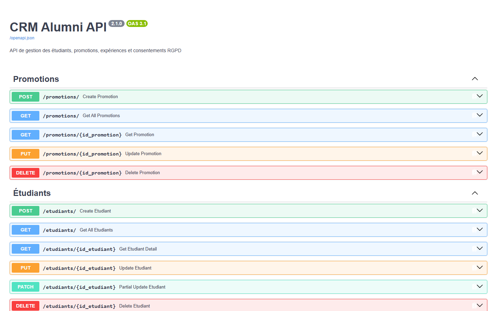
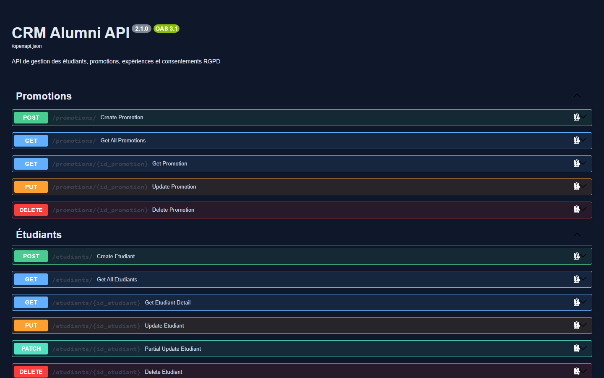

# Rapport de stage Pré-MSc 2026

**Conception et développement d'un système de suivi du parcours étudiant et de valorisation du réseau des anciens (Alumni CRM)**

**Auteur :** Rafik Djemadi
**Formation :** Pré-MSc — IONIS-STM
**Tuteur pédagogique :** Joly Donfack
**Période du stage :** stage de substitution (programme Pré-MSc 2026), mené jusqu'à la soutenance du 18 septembre 2026.
**Soutenance :** 18 septembre 2026

---

## Résumé

Ce rapport présente le stage que j'ai effectué dans le cadre du programme Pré-MSc 2026 à l'IONIS-STM. Le sujet portait sur la conception et le développement d'un Alumni CRM, c'est-à-dire un système web centralisé qui doit permettre de suivre le parcours des étudiants et de valoriser le réseau des anciens diplômés.

Le point de départ était un constat simple : l'école ne disposait d'aucun outil pour suivre un étudiant de son inscription jusqu'à son évolution professionnelle. Les données d'insertion traînaient un peu partout, les indicateurs se calculaient à la main, le réseau des anciens était inactif et rien n'était formalisé côté RGPD. Le sujet revenait donc à relever quatre défis : centraliser les données, fiabiliser les indicateurs d'insertion, animer le réseau et intégrer la conformité réglementaire dès le départ.

J'ai travaillé en boucles : modélisation de la base, puis backend, puis frontend, puis un audit de sécurité, et enfin la rédaction des livrables. Le système repose sur une architecture trois tiers (FastAPI, React/Vite, PostgreSQL) et compte 14 tables, 84 endpoints API, 14 routes frontend et 8 indicateurs de base d'insertion professionnelle. S'y ajoute un indicateur dérivé pour chaque question taguée KPI active : le tableau de bord s'enrichit donc sans toucher au code.

Au final, le prototype couvre l'intégralité du périmètre défini dans le sujet. La conformité RGPD a été pensée dès la conception : consentements traçables, workflow de demandes de suppression et d'anonymisation, journal d'audit et durée de conservation affichée. Un audit de sécurité a aussi permis de corriger des failles d'authentification et de protéger des routes qui étaient ouvertes. Les livrables complémentaires (cartographie des données, charte RGPD, stratégie de mise à jour, analyse des indicateurs d'insertion et guide des processus d'animation du réseau) couvrent le volet Management du sujet. Le principal chantier restant avant une mise en production reste l'introduction d'une suite de tests automatisés, qui n'est pas dans le dépôt à l'issue du stage.

---

## Abstract

**Keywords:** CRM, Alumni, graduate employment, GDPR, FastAPI, React, PostgreSQL.

This report describes the internship I completed at IONIS-STM as part of the 2026 Pre-MSc program. The assignment was to design and build an Alumni CRM, i.e. a centralized web application for tracking student career paths and strengthening the alumni network.

The starting point was a simple observation: the institution had no tool to follow a student's full lifecycle, from enrollment to professional development. Employment data was scattered, indicators were computed manually, the alumni network was dormant, and GDPR compliance had not been formalized. The brief therefore came down to four challenges: centralize the data, make employment indicators reliable, animate the network, and build regulatory compliance in from the start.

I worked in iterative cycles: data modeling, backend, frontend, a security audit, then documentation. The final system relies on a three-tier architecture (FastAPI, React/Vite, PostgreSQL) and includes 14 database tables, 84 API endpoints, 14 frontend routes, and 8 core employment indicators — plus one derived indicator per active KPI-tagged question.

The internship delivered a functional prototype covering the whole scope of the brief. GDPR compliance was embedded from the start: traceable consent management, a deletion and anonymization request workflow, an audit log, and visible data retention periods. A security audit led to the correction of authentication flaws and the protection of routes that were initially left open. The supplementary deliverables (data mapping, GDPR charter, data update strategy, employment indicator analysis, and an alumni network process guide) cover the Management part of the specification. The main remaining piece of work before production is a proper automated test suite, which is missing from the repository at the end of the internship.

---

## Préambule — Remerciements

### Remerciements au tuteur pédagogique

Je tiens d'abord à remercier mon tuteur pédagogique, **M. Joly Donfack**, pour son accompagnement tout au long du stage. Sa disponibilité et ses retours ont beaucoup guidé mes choix d'architecture et mes priorités fonctionnelles. Les points de suivi réguliers m'ont surtout aidé à garder une direction claire alors que le périmètre était assez large.

### Remerciements à l'équipe et au projet

Ce stage de substitution m'a été proposé directement par IONIS-STM, dans le cadre du programme destiné aux étudiants n'ayant pas trouvé de placement en entreprise. Comme aucune équipe technique n'était dédiée au projet, j'ai dû structurer seul tout le processus de développement, de la modélisation du MCD jusqu'à la rédaction des livrables. Ce fut en soi une expérience très formatrice pour l'autonomie et la prise de décision. Je remercie [nom(s) et fonction(s) des autres interlocuteurs impliqués] pour les échanges qui ont enrichi la démarche.

### Remerciements à l'école

Je remercie enfin IONIS-STM et son équipe pédagogique pour la qualité de la formation en Pré-MSc. Les compétences acquises en développement web, en modélisation de bases de données et en gestion de projets m'ont permis d'aborder ce stage avec une base solide.

---

## Liste des abréviations et glossaire

|**Abréviation**|**Signification**|
|---|---|
| API | Application Programming Interface — interface de programmation entre le frontend et le backend |
| CASCADE | Mécanisme de clé étrangère PostgreSQL assurant la suppression en cascade des enregistrements liés |
| CHECK | Contrainte d'intégrité PostgreSQL limitant les valeurs autorisées dans une colonne |
| CNIL | Commission Nationale de l'Informatique et des Libertés — autorité française de contrôle de la protection des données |
| CRM | Customer Relationship Management — système de gestion de la relation client (ici appliqué au réseau des anciens) |
| CRUD | Create, Read, Update, Delete — les quatre opérations de base sur les données |
| CSS | Cascading Style Sheets — langage de mise en forme des pages web |
| CSV | Comma-Separated Values — format tabulaire pour l'import/export de données |
| CTI | Commission des Titres d'Ingénieur — organisme d'accréditation des formations d'ingénieurs |
| DOCX | Format de document Microsoft Word, supporté pour l'import de données |
| DPO | Data Protection Officer — délégué à la protection des données, contact réglementaire RGPD |
| E2E | End-to-End — type de test couvrant l'ensemble du flux applicatif |
| FK | Foreign Key — clé étrangère, contrainte de liaison entre tables |
| GDPR | General Data Protection Regulation — version anglaise du RGPD |
| HCERES | Haute Autorité pour l'Évaluation de la Recherche et de l'Enseignement Supérieur |
| HTTP | HyperText Transfer Protocol — protocole de transfert hypertexte |
| HTML | HyperText Markup Language — langage structurant le contenu des pages web |
| IONIS | Groupe IONIS Education — groupe d'enseignement supérieur privé |
| IDOR | Insecure Direct Object Reference — faille d'accès à un objet via un identifiant modifiable |
| JSON | JavaScript Object Notation — format d'échange de données structurées |
| JSONB | Type PostgreSQL stockant du JSON en binaire optimisé, avec indexation |
| JWT | JSON Web Token — jeton d'authentification utilisé pour les sessions |
| KPI | Key Performance Indicator — indicateur clé de performance du tableau de bord |
| MCD | Modèle Conceptuel de Données — représentation abstraite des entités et relations |
| MLD | Modèle Logique de Données — traduction du MCD en schéma de tables relationnelles |
| N:M | Cardinalité plusieurs-à-plusieurs — par exemple Étudiant ↔ Certification |
| OTP | One-Time Password — code à usage unique, ici code à 6 chiffres envoyé par email |
| ORM | Object-Relational Mapping — correspondance objet-relationnel pour l'accès aux bases de données |
| PATCH | Méthode HTTP de modification partielle d'une ressource |
| pg8000 | Pilote PostgreSQL pur Python, utilisé pour la connexion à la base de données |
| PostgreSQL | Système de gestion de base de données relationnelle open source |
| PWA | Progressive Web App — application web offrant une expérience proche du natif |
| Pydantic | Bibliothèque Python de validation de données basée sur les annotations de type |
| React | Bibliothèque JavaScript pour la construction d'interfaces utilisateur |
| README | Fichier de documentation d'un dépôt décrivant installation et usage |
| REST | Representational State Transfer — style d'architecture pour les API web |
| RGPD | Règlement Général sur la Protection des Données (Règlement UE 2016/679) |
| SPA | Single Page Application — application web mono-page (architecture React) |
| SQL | Structured Query Language — langage de requête des bases relationnelles (PostgreSQL) |
| SQLSTATE | Codes d'erreur SQL standardisés pour le diagnostic des erreurs de base de données |
| SVG | Scalable Vector Graphics — format vectoriel utilisé pour les graphiques du dashboard |
| Swagger | Interface de documentation et d'essai des API, auto-générée par FastAPI |
| TOCTOU | Time Of Check To Time Of Use — faille liée à la vérification puis l'utilisation |
| TTL | Time-To-Live — durée de validité d'un élément (ici : code OTP) |
| Vite | Outil de build et serveur de développement frontend rapide |
| XLSX | Format de classeur Microsoft Excel, supporté pour l'import/export des données |

---

## 1. Contexte de la structure d'accueil

### 1.1 Présentation d'IONIS-STM

IONIS-STM fait partie du groupe IONIS Education Group, premier groupe privé d'enseignement supérieur en France. Le groupe rassemble plusieurs écoles d'ingénieurs et de management (EPITECH, ESGI, ESM, ISA, IIM, ISEN, ICS), dans les domaines du numérique, de l'ingénierie et du management.

L'école dispense des programmes de niveau Pré-MSc, MSc1 et MSc2, destinés aux étudiants en reconversion ou en poursuite d'études après un premier diplôme. Les formations sont organisées en filières spécialisées (développement, cybersécurité, data, management, marketing digital) et l'établissement forme chaque année plusieurs centaines de diplômés.

Suivre l'insertion professionnelle de ces anciens élèves est un vrai enjeu : cela permet de piloter la formation, de répondre aux exigences des organismes de tutelle (CTI, HCERES) et d'animer le réseau alumni.

### 1.2 Secteur d'activité et acteurs clés

Le secteur de l'enseignement supérieur privé en France est marqué par une concurrence forte entre établissements. Chacun cherche à attirer les candidats, à valoriser l'employabilité de ses diplômés et à entretenir des relations durables avec les entreprises partenaires.

Les acteurs que j'ai identifiés sont les suivants :

- **Les étudiants et alumni** : bénéficiaires des formations, dont la trajectoire professionnelle sert de principal indicateur de qualité.
- **Le service des relations entreprises** : responsable du placement, des partenariats et du suivi de l'insertion.
- **La direction pédagogique** : pilote l'offre de formation au regard des besoins du marché.
- **Les organismes de certification** (CTI, HCERES) : exigent des rapports d'insertion réguliers comme condition d'accréditation.
- **Les entreprises partenaires** : recrutent les diplômés et contribuent à la pertinence des programmes.

Côté technique, j'ai retenu une architecture trois tiers : un backend REST (FastAPI), un frontend en SPA (React/Vite) et une base de données relationnelle (PostgreSQL). Cette organisation sépare clairement la logique métier, la présentation et le stockage des données.

### 1.3 Contexte économique et positionnement

Le marché de l'enseignement supérieur privé repose en grande partie sur la capacité d'un établissement à mettre en avant l'employabilité de ses diplômés. Les taux d'insertion publiés (à 6 et 12 mois) sont devenus un argument de vente décisif auprès des candidats : un établissement qui ne produit pas de chiffres fiables perd rapidement en crédibilité.

Dans ce contexte, le réseau alumni joue un double rôle. C'est d'abord une source de données : les parcours des anciens alimentent les indicateurs de pilotage. C'est ensuite un levier commercial : un ancien qui recommande son école attire de futurs candidats. Le projet Alumni CRM répond directement à ces deux enjeux.

Le groupe IONIS Education Group est l'un des principaux acteurs privés du secteur en France. Chaque école du groupe vise des parcours spécifiques, mais toutes partagent la même exigence de placement professionnel et de suivi des diplômés. D'où un enjeu commun : disposer d'un dispositif de suivi alumni capable de fonctionner à l'échelle de plusieurs centaines de diplômés par promotion.

### 1.4 Problématique spécifique du stage

L'absence d'outil centralisé de suivi alumni posait quatre problèmes concrets.

1. **Données dispersées.** Les informations d'insertion étaient collectées au coup par coup (emails, formulaires papier, appels téléphoniques), sans stockage structuré ni traçabilité.
2. **Indicateurs non fiables.** Le calcul des taux d'insertion demandait des croisements manuels longs et propices aux erreurs.
3. **Réseau inanimé.** Aucun canal structuré ne permettait aux anciens de maintenir leur profil à jour ni de rester en contact avec l'école.
4. **Conformité RGPD non formalisée.** La collecte des données personnelles des alumni n'obéissait à aucun workflow traçable.

La problématique du stage revenait donc à concevoir et développer un système capable de répondre à ces quatre problèmes en même temps, tout en fournissant des indicateurs exploitables pour le pilotage de la formation.

---

## 2. Présentation du stage et déroulement des missions

### 2.1 Contexte et objectifs du stage

Ce stage est un **stage de substitution**, proposé directement par IONIS-STM aux étudiants n'ayant pas trouvé de placement en entreprise. La structure d'accueil est donc l'école elle-même et l'encadrement est assuré par un tuteur pédagogique interne.

Le sujet officiel est le suivant : *« Conception et développement d'un système de suivi du parcours étudiant et de valorisation du réseau des anciens (Alumni CRM) »*.

Le projet poursuivait quatre objectifs fonctionnels :

- Créer une solution centralisée pour suivre le cycle de vie de l'étudiant, de l'inscription à l'évolution professionnelle post-diplôme.
- Fournir des indicateurs d'insertion professionnelle exploitables par le service des relations entreprises.
- Assurer la conformité RGPD de toutes les opérations de collecte et de traitement des données personnelles.
- Produire un guide des processus d'animation du réseau alumni.

Les livrables attendus étaient le rapport de stage, le schéma conceptuel MCD/MLD, un prototype fonctionnel et le guide des processus d'animation du réseau.

### 2.2 Missions confiées et responsabilités

Le stage s'est articulé autour de cinq domaines de mission. Le niveau d'autonomie était total : aucune équipe technique n'était dédiée au projet, et j'étais responsable de l'ensemble des choix techniques.

**Mission 1 — Modélisation et conception de la base de données**

J'ai commencé par concevoir un modèle de données relationnel couvrant cinq domaines fonctionnels : données étudiantes, parcours professionnel, conformité RGPD, questionnaires et infrastructure technique. Le résultat est une base PostgreSQL de **14 tables** réparties en 5 groupes :

|**Domaine**|**Tables**|
|---|---|
| Données étudiantes | ETUDIANT, PROMOTION |
| Parcours professionnel | ENTREPRISE, EXPERIENCE_PRO, CERTIFICATION, OBTIENT (association N:M) |
| RGPD | CONSENTEMENT_RGPD, DEMANDE_RGPD, AUDIT_LOG |
| Questionnaires | QUESTIONNAIRE, QUESTION, REPONSE_QUESTIONNAIRE |
| Infrastructure | otp_codes, schema_migrations |

J'ai respecté les règles de transformation classiques pour passer du MCD au MLD (entité forte vers table, association N:M vers table de jonction). J'ai versionné **17 migrations SQL** (16 à la date de l'audit de conformité, auxquelles s'ajoute la migration corrective 016 `016_contraintes_check.sql` du 10/09/2026), appliquées par un script maison (`run_migrations.py`) qui ne rejoue que les migrations non encore exécutées (table de suivi `schema_migrations`).

**Mission 2 — Développement du backend API**

J'ai ensuite développé une API REST complète avec FastAPI (Python). L'API compte **16 routeurs** et **84 endpoints** :

- Authentification OTP par email (code à 6 chiffres) côté alumni, code d'accès et clé API côté admin, sessions JWT.
- Gestion des promotions et des étudiants, avec CRUD complet.
- Entreprises et expériences professionnelles, avec création automatique de l'entreprise si elle n'existe pas.
- Certifications : catalogue et association N:M avec les étudiants.
- RGPD : consentements, demandes de suppression et d'anonymisation, journal d'audit.
- Questionnaires : CRUD côté admin, soumission côté alumni avec validation des clés.
- Dashboard administrateur : indicateurs, statistiques, filtrage, évolution temporelle.
- Import/export : template Excel, import alumni CSV/Excel avec détection du séparateur, export complet.
- Nettoyage : détection d'orphelins, fusion de doublons, archivage, purge différée.

**Mission 3 — Développement du frontend React**

J'ai développé une interface utilisateur complète avec React et Vite, structurée en deux espaces.

L'espace administrateur comprend un tableau de bord avec KPI et graphiques, un annuaire filtrable, la gestion des promotions, l'import/export Excel, la gestion des questionnaires et le traitement des demandes RGPD.

L'espace alumni comprend l'inscription multi-étapes, la vérification OTP, l'édition du profil, le parcours professionnel, le consentement RGPD et le questionnaire annuel. Le parcours permet désormais la modification directe d'une expérience existante via la route `PUT /experiences/{id_experience}` (mise à jour atomique, plus de suppression-recerecréation).

Le frontend compte **14 routes principales** et des composants partagés (thème clair/sombre, protection de routes par rôle). La validation reposait sur des tests manuels, la vérification du build de production (`vite build`) et le lint (`oxlint`). Aucune suite de tests automatisés n'est conservée dans le dépôt à l'issue du stage.

**Mission 4 — Conformité RGPD et audit de sécurité**

J'ai intégré la conformité RGPD à chaque étape du système :

- 4 types de consentement gérés indépendamment : prise de contact, partage de données, enquêtes, newsletter.
- Workflow de traitement des demandes RGPD : statut `envoyée → en cours de traitement → traitée/rejetée`, avec verrou anti-double-traitement.
- Exports de données (droit d'accès et portabilité) aux formats JSON, Excel ou CSV, en auto-service côté alumni et côté admin, avec une section « Erreurs » dans l'export groupé.
- Distinction entre anonymisation (réversible, prévue par le RGPD) et suppression définitive (réservée aux doublons).
- Purge différée configurable (`PURGE_DELAY_MONTHS`, 6 mois par défaut).
- Information de l'alumni dans l'interface de consentement : durée de conservation des données et contact DPO.

L'audit de sécurité a permis de corriger plusieurs failles :

|**Faiblesse**|**Correctif**|
|---|---|
| Routes POST/DELETE de promotions et entreprises non protégées | Ajout de `require_admin_api_key` |
| Route d'upload morte et non protégée | Suppression du router correspondant, import exclusivement via la route protégée |
| Un alumni pouvait lire ou modifier les réponses d'un autre | Correction via `require_owner_or_admin` |
| Modification possible de comptes anonymisés | Garde centralisé `refuser_compte_anonymise` sur 12 points d'écriture |
| Suppression d'une promotion avec étudiants rattachés | `DELETE /promotions/{id}` renvoie 409 sauf avec `?force=true` |

**Mission 5 — Indicateurs d'insertion et documentation**

J'ai défini et implémenté **8 indicateurs de base d'insertion professionnelle**, chacun avec une formule et une source précises. S'y ajoutent des indicateurs dérivés, générés automatiquement une fois par question taguée KPI des questionnaires actifs :

|**Indicateur**|**Formule / Source**|**Exemple**|
|---|---|---|
| Taux d'emploi à 6 mois | Expériences actives à la date de référence ÷ total alumni | Promo 2025 : 9/12 en poste = 75 % |
| Taux d'emploi global brut | (Alumni avec expérience ÷ total alumni) × 100 | 30 en poste / 40 = 75 % |
| Répartition par type de contrat | `COUNT(*)` des expériences en cours | CDI 8, CDD 3, Freelance 2 |
| Salaire moyen | Calcul sur `salary_annuel` avec repli sur le champ texte historique | (38000+42000+50000)/3 = 43333 |
| Alumni actifs | Alumni avec ≥ 1 expérience enregistrée | 45 alumni actifs sur 60 |
| Taux de complétion | Alumni avec ≥ 1 expérience enregistrée dans `EXPERIENCE_PRO` | 45 alumni avec expérience / 60 = 75 % |
| Alumni par promotion | Comptage par `id_promotion` | 2025 : 12 / 75 % |
| Répartition par secteur | Agrégation du champ `secteur_activite` | Info 3, Finance 2, Santé 1 |

Le calcul du taux d'emploi à 6 mois m'a demandé pas mal d'attention. L'ancien calcul comptait des expériences déjà terminées, ce qui surestimait les résultats. Le nouveau ne retient que les expériences actives à la date de référence et exclut les cohortes trop récentes (valeur `null` plutôt qu'un chiffre trompeur).

### 2.3 Résultats obtenus et impact des actions menées

Le prototype couvre l'intégralité du périmètre fonctionnel défini dans le sujet officiel.

- **14 tables** de base de données, validées par introspection et rejeu complet des migrations sur une base vide (aucune différence structurelle constatée).
- **84 endpoints** API avec authentification OTP et JWT et protection admin.
- **14 routes** frontend couvrant les espaces admin et alumni.
- **8 indicateurs de base** d'insertion professionnelle, exposés via des endpoints dédiés (`/admin/indicateurs`, `/admin/indicateurs/secteurs`, `/admin/indicateurs/types-contrat`), complétés d'un endpoint agrégé partenaire et d'un indicateur dérivé par question taguée active (variable).
- **5 documents** de livraison complémentaires couvrant le volet Management du sujet : cartographie des données, charte RGPD, analyse des indicateurs d'insertion, stratégie de mise à jour des données et guide des processus d'animation du réseau.

Le dispositif dont je suis le plus satisfait est le système de **tags KPI**. Chaque question de questionnaire peut être étiquetée (par exemple `adequation_formation`) pour alimenter automatiquement un indicateur de pilotage. Le mécanisme est extensible : ajouter un tag à une question fait apparaître l'indicateur correspondant dans le tableau de bord, sans toucher au code backend.

### 2.4 Réponse à la problématique initiale

Le système répond aux quatre problèmes identifiés dans la section 1.4.

|**Problème**|**Solution apportée**|
|---|---|
| Données dispersées | Base centralisée de 14 tables avec import Excel/CSV |
| Indicateurs non fiables | 8 indicateurs de base automatisés, fiabilisés par filtrage temporel, plus 1 indicateur dérivé par question taguée |
| Réseau inanimé | Espace alumni : inscription, profil, parcours, questionnaire annuel, newsletter |
| Conformité RGPD non formalisée | Consentements traçables, workflow de demandes, journal d'audit, durée de conservation, contact DPO |

### 2.5 Organisation du travail et ressources à disposition

**Cadre du stage.** Ce stage de substitution m'a été proposé directement par IONIS-STM : la structure d'accueil est l'école elle-même, avec un encadrement assuré par un tuteur pédagogique interne.

**Travail en solo.** Le projet a été réalisé en solo : aucune équipe technique n'était dédiée au développement. Toutes les responsabilités reposaient donc sur un seul développeur. C'est très formateur pour l'autonomie et la prise de décision, mais ça expose aussi à des risques, notamment l'absence de revue par les pairs.

**Encadrement pédagogique.** Les suivis réguliers avec le tuteur ont fourni un cadre de validation des choix d'architecture et des priorités fonctionnelles. [À compléter : fréquence des points de suivi, modalités de communication utilisées.]

**Incident OneDrive → Git.** Le projet était initialement stocké sous OneDrive sans dépôt Git. Un conflit de synchronisation concurrente a fait revenir plusieurs fichiers frontend en cours de développement à une version antérieure. Cet incident m'a conduit à initialiser un dépôt Git avec un `.gitignore` racine consolidé. La leçon retenue : le versionnement doit précéder la première ligne de code.

**Ressources techniques.** Le poste de développement était local. Les API tierces comprenaient notamment Resend pour l'envoi d'emails OTP en production (mode console en développement). La base PostgreSQL fonctionnait en local. Aucun environnement de staging cloud n'était prévu.

### 2.6 Méthodes et stratégies mises en œuvre

**Approche de développement.** J'ai suivi une démarche itérative : modélisation → backend → frontend → audit → documentation. Chaque fonctionnalité était développée, testée manuellement puis consolidée avant de passer à la suivante. Cette approche m'a permis de détecter tôt des incohérences de modélisation, par exemple le drift de migration sur `reponse_questionnaire.id_etudiant`, dont la contrainte `ON DELETE CASCADE` était présente en base réelle mais absente du fichier de migration d'origine.

**Audit de fiabilité base/API.** J'ai réalisé un audit complet de la table ETUDIANT et des 9 autres tables. J'y ai découvert des champs acceptés en écriture mais jamais persistés, un endpoint `DELETE /entreprises/{id}` cassé, et le drift de migration mentionné plus haut. Le rejeu complet des migrations sur une base vide (16 à la date de l'audit, 17 avec la migration 016) m'a servi de test de validation. Cet audit a aussi relevé des points secondaires, depuis résolus au 10/09/2026 : statut des consentements contraint (`Literal` côté API et `CHECK` en base via la migration 016), date d'obtention des certifications validée (pas de date future), réponses de questionnaire contrôlées contre le type de la question, mise à jour atomique d'une expérience (`PUT /experiences/{id_experience}`), ordre `0` respecté, `actif` et `nb_etudiants` réels. Restent deux points de maintenance en P3 : la purge des tables `otp_codes` et `AUDIT_LOG`, et l'échec silencieux de `_write_audit_log`. L'ensemble est consigné dans `AUDIT_COHERENCE.md` (synthèse + détail table-par-champ).

**Modélisation par introspection.** J'ai régénéré le schéma MCD/MLD par introspection réelle de la base (14 tables), plutôt qu'à partir du fichier de conception initial. Cette approche m'a permis de détecter un ancien fichier obsolète (11 tables au lieu de 14, tables manquantes : DEMANDE_RGPD, OTP_CODES, SCHEMA_MIGRATIONS), depuis supprimé.

**Choix des outils.** J'ai retenu FastAPI pour sa rapidité de développement et sa documentation automatique (Swagger), React/Vite pour une expérience utilisateur fluide en SPA, et PostgreSQL pour un modèle relationnel robuste et lisible. Les arbitrages sont documentés et justifiés tout au long du rapport.

---

## 3. Bilan de l'expérience professionnelle

### 3.1 Compétences acquises lors du stage

**Compétences techniques.**

- *Développement web full-stack* : conception et implémentation d'une application complète avec FastAPI côté backend et React/Vite côté frontend, communication via API REST JSON. Patterns CRUD, pagination, validation Pydantic et gestion d'état côté client appliqués sur l'ensemble des modules métier.
- *Migrations de base de données* : mise en place d'un système maison de migrations versionnées. La principale leçon : une migration déjà appliquée ne se modifie jamais, on corrige par une nouvelle migration. C'est ce qui a été fait pour le drift de la migration 003, traité par une migration corrective idempotente (011).
- *Sécurité applicative* : correction de failles d'ownership (IDOR), remplacement des vérifications « SELECT puis INSERT » par la gestion des `IntegrityError` (ce qui élimine les race conditions TOCTOU), sanitisation des messages d'erreur, protection des routes admin par clé API, mise en place du garde `refuser_compte_anonymise`.
- *Gestion des sessions et des rôles* : séparation stricte des sessions admin et alumni dans le navigateur, vérification du rôle contenu dans le JWT avant chaque appel sensible, purge d'un token orphelin à la réception d'un 401.
- *Conception de workflows concurrents* : statut intermédiaire `en_cours_de_traitement` et verrou applicatif pour empêcher deux administrateurs de travailler sur la même demande RGPD.
- *Indicateurs statistiques honnêtes* : exposition des hypothèses de calcul dans l'API (champ `hypothese`) et refus d'afficher un chiffre trompeur.

**Compétences transversales.**

- *Autonomie et prise de décision* : projet mené en solo, choix d'architecture assumés et documentés.
- *Documentation traitée comme du code* : livrables PDF et DOCX générés par des scripts (fpdf2, python-docx), donc régénérables et maintenables.
- *Rigueur méthodologique* : audit de cohérence entre le modèle et l'implémentation réelle, mené par introspection SQL et écrit avant tout correctif.

### 3.2 Difficultés rencontrées et solutions apportées

**Difficulté 1 — Bug d'authentification croisée entre les espaces admin et alumni.**

Le token admin et le token alumni partageaient la même clé de stockage dans le navigateur. Résultat : un JWT administrateur pouvait partir sur les routes `/rgpd/*` réservées aux alumni, avec des erreurs 403 difficilement explicables.

*Solution.* Clés de stockage distinctes (`admin_role` / `alumni_id`), nettoyage mutuel, vérification du rôle dans le JWT avant chaque appel sensible, et purge automatique du token en cas de session orpheline.

**Difficulté 2 — Dérive entre le modèle de données et la base réelle.**

Un audit d'introspection a révélé des écarts entre les migrations et l'état réel de la base : clé étrangère en `ON DELETE CASCADE` sans contrepartie dans la migration, route `DELETE /entreprises/{id}` cassée, doublons de consentements faute de contrainte d'unicité.

*Solution.* Migrations correctives dédiées et mise en place du rejeu complet des migrations sur base vide comme test de validation. Pratique retenue : rejouer les migrations à chaque évolution du schéma.

**Difficulté 3 — Deux administrateurs pouvaient traiter la même demande RGPD.**

Le cycle initial (`en_attente → traitée/rejetée`) ne laissait aucune trace d'une prise en charge.

*Solution.* Ajout d'un statut intermédiaire `en_cours_de_traitement` et verrou applicatif : toute décision sur une demande déjà prise en charge est refusée.

**Difficulté 4 — Un indicateur d'insertion trompeur.**

Le calcul initial du taux d'emploi à 6 mois comptait des expériences déjà terminées, surestimant les résultats pour les promotions récentes.

*Solution.* Filtrage sur les expériences actives à la date de référence et exclusion des cohortes dont la fenêtre de six mois n'est pas écoulée.

**Difficulté 5 — Absence de versionnement Git et incident de synchronisation.**

Le projet était stocké sous OneDrive sans dépôt Git. Un conflit de synchronisation a entraîné la perte de fichiers frontend en développement, sans possibilité de récupération.

*Solution.* Récupération manuelle puis initialisation d'un dépôt Git avec `.gitignore` consolidé. La leçon : le versionnement doit précéder la première ligne de code.

**Difficulté 6 — Modification d'une expérience non atomique.**

L'interface alumni ne proposait pas de mise à jour directe d'une expérience. L'alumni devait la supprimer puis la recréer, soit deux transactions HTTP distinctes. Si la recréation échouait, l'expérience était perdue. L'audit de cohérence a relevé ce point comme non atomique.

*Solution.* Ajout de la route `PUT /experiences/{id_experience}` : mise à jour atomique en une seule transaction (résolution ou création de l'entreprise, exclusivité du poste actuel, refus sur un compte anonymisé). Côté frontend, la sauvegarde du parcours (`AlumniCareer.jsx`) met désormais à jour chaque expérience existante par un `PUT` au lieu d'une suppression-recerecréation.

**Difficulté 7 — Messages d'erreur trompeurs.**

L'audit a révélé des messages d'erreur peu explicites. Par exemple, sur une association étudiant/certification en doublon, l'API renvoyait « L'étudiant ou la certification n'existe pas », alors même que l'étudiant existait réellement. Certains endpoints renvoyaient aussi un code 200 avec un corps d'erreur au lieu d'une vraie erreur HTTP.

*Solution.* Sanitisation et correction des messages d'erreur, remplacement des 200 trompeurs par de vraies exceptions HTTP. Ce correctif s'étend à d'autres modules (import, indicateurs).

**Difficulté 8 — Filtres invalides ignorés silencieusement.**

Dans la liste admin des demandes RGPD, un paramètre de filtre invalide (statut ou type de demande inconnu) était silencieusement ignoré : l'API renvoyait la liste complète au lieu d'une erreur. Ce comportement masquait les fautes de frappe dans les requêtes.

*Solution.* Validation explicite des paramètres : un statut ou un type de demande inconnu renvoie désormais une erreur `422` avec les valeurs attendues, au lieu de la liste complète. Le point a été relevé dans l'audit puis corrigé.

**Difficulté 9 — Dérive de stockage des données temporaires.**

Les codes OTP expirés et le journal d'audit s'accumulaient sans purge. L'audit a constaté 90 codes OTP pour un faible volume d'étudiants de test, et aucune procédure de rétention ne couvrait ces tables.

*Solution.* La purge différée (`purge.py`) couvre les comptes anonymisés. L'ajout d'une rétention sur les tables `otp_codes` et `AUDIT_LOG` est consigné en piste d'amélioration (section 4.1).

**Difficulté 10 — Spécificités du driver PostgreSQL pg8000.**

Le backend utilise pg8000, un driver Python pur sans ORM. Son comportement diffère de celui d'autres pilotes (psycopg2) sur plusieurs points, qu'il a fallu gérer au fil du code.

*Cas le plus marquant : la sérialisation JSONB.* Pour la colonne `skills`, pg8000 renvoyait tantôt une chaîne JSON, tantôt un objet Python prêt à l'emploi, sans cohérence. À la lecture, un `isinstance(x, str)` avec re-parsing était nécessaire pour obtenir une liste exploitable. À l'écriture, le driver ne sérialise pas automatiquement les listes/dicts Python vers JSONB : il fallait passer par `json.dumps()` et un cast explicite `%s::jsonb` dans la requête.

*Autres points.* pg8000 n'expose pas d'ID généré automatiquement : chaque insert de données à identifiant nécessite une clause `RETURNING id_...` et la lecture de la valeur retournée. Les erreurs d'intégrité arrivent via `pg8000.dbapi.IntegrityError` dont on analyse le code SQLSTATE (dict `args[0]["C"]`) ou le texte pour distinguer doublon et clé étrangère, et renvoyer des messages corrects. Enfin, les lignes du résultat sont des tuples positionnels, sans accès par nom de colonne : un helper `rows_to_dicts` (basé sur `cursor.description`) remplace le pattern fragile d'accès par index. pg8000 ne fournissant pas de pool de connexions, un pool artisanal sur file thread-safe a été implémenté dans `database.py`.

*Solution.* Ces points ont été traités de façon centralisée (helper de sérialisation de lignes, helpers d'analyse des `IntegrityError`) et documentés dans le code, pour éviter que chaque route ne réimplémente la même logique.

**Difficulté 11 — Identifiants PostgreSQL en dur dans le code.**

Au départ, les identifiants de connexion à la base figuraient en dur dans le code source. C'était à la fois un risque de sécurité (secrets versionnés) et une gêne pour changer d'environnement.

*Solution.* Migration des identifiants vers des variables d'environnement (`config.py`, `.env.example`), avec un dépôt ne contenant plus aucun secret.

**Difficulté 12 — Messages d'erreur exposant des détails d'exception.**

Les messages d'erreur renvoyés au client contenaient le détail brut des exceptions (`str(e)`), ce qui pouvait fuiter des informations sur la structure interne (noms de tables, requêtes).

*Solution.* Sanitisation des messages côté serveur : le détail complet est loggé côté backend, un message générique est renvoyé au client.

**Difficulté 13 — Envoi de fichier sans contrôle préalable.**

La route d'import de données acceptait un téléversement de fichier sans vérifier l'extension ni limiter la taille.

*Solution.* Ajout de la vérification de l'extension, d'une limite de taille (5 Mo par défaut) et de la validation de chaque ligne via `schemas.EtudiantCreate` avant insertion, au lieu d'insérer les valeurs brutes du fichier.

Récapitulatif des difficultés et des leçons retenues :

|**Problème**|**Solution**|**Leçon retenue**|
|---|---|---|
| Session partagée admin/alumni | Clés de stockage distinctes | Vérifier le rôle à chaque appel sensible |
| Dérive modèle/base | Migrations correctives + rejeu | Rejouer les migrations à chaque évolution |
| Conflit de traitement RGPD | Statut intermédiaire + verrou | Tracer toute prise en charge |
| Indicateur surestimé | Filtrage temporel | Refuser d'afficher un chiffre trompeur |
| Perte de fichiers | Démarrage d'un dépôt Git | Versionner avant de développer |
| Modification non atomique | `PUT /experiences/{id_experience}` + sauvegarde différenciée | Traiter chaque écriture comme une transaction |
| Messages d'erreur trompeurs | Vraies exceptions HTTP | Ne jamais mélanger statut et corps d'erreur |
| Filtres invalides ignorés | Validation des paramètres | Rejeter explicitement les entrées invalides |
| Données temporaires sans purge | Rétention à ajouter | Prévoir la rétention dès la conception |
| Sérialisation JSONB non uniforme | `isinstance` + `json.dumps` + `::jsonb` | Connaître les particularités du driver choisi |
| Identifiants en dur | Variables d'environnement | Les secrets n'ont pas leur place dans le code |
| Messages d'erreur bruts | Sanitisation + log serveur | Ne jamais exposer le détail d'une exception |
| Upload sans contrôle | Extension + taille + validation | Valider toute entrée externe avant insertion |

---

## 4. Axes d'amélioration

Cette section recense les axes d'amélioration, classés par horizon de réalisation.

### 4.1 Axes à traiter en priorité (court terme)

Ces améliorations relèvent de correctifs à appliquer avant toute mise en production.

**Tests automatisés.** Le principal chantier restant est l'introduction durable d'une suite de tests automatisés (pytest côté backend, Vitest/Testing Library côté frontend), actuellement absente du dépôt. Quelques tests d'intégration auraient intercepté la route `DELETE /entreprises/{id}` cassée et les endpoints renvoyant 200 avec un corps d'erreur. Le script de test E2E documenté dans le README a disparu du dépôt et doit être reconstitué. La mise en place de tests sur les routes critiques est un prérequis à tout déploiement.

**Automatisation de l'envoi du questionnaire annuel.** L'activation des questionnaires reste manuelle. Un mécanisme de planification automatique (cron) permettrait d'envoyer les relances email aux alumni n'ayant pas répondu, selon un calendrier défini. L'endpoint `POST /admin/questionnaires/notifier` est déjà implémenté ; il manque le déclenchement périodique et l'interface frontend.

**Composant frontend d'envoi de newsletter.** L'endpoint `POST /newsletter/envoyer` est opérationnel, mais le composant de rédaction et d'envoi depuis l'interface n'est pas développé. Le mécanisme de désinscription automatique n'est pas non plus implémenté.

**Standardisation des contraintes de validation.** Ce point a été traité au 10/09/2026 : le statut des consentements est désormais un `Literal` côté API doublé d'une contrainte `CHECK` en base (migration 016), la date d'obtention des certifications ne peut plus être dans le futur, les réponses de questionnaire sont contrôlées contre le type de la question, et des contraintes `CHECK` garantissent la cohérence des dates, du salaire et du poste actuel des expériences ainsi que le type des questions. La généralisation des contraintes aux longueurs minimales et à l'unicité des libellés reste une bonne pratique à poursuivre.

### 4.2 Évolutions fonctionnelles à moyen terme

**Module de mentorat.** Un module de mise en relation entre alumni seniors et étudiants actuels exploiterait le réseau à des fins pédagogiques. Les mises en relation s'appuient aujourd'hui sur l'annuaire filtrable.

**Chiffrement applicatif des données sensibles.** Les données personnelles ne font l'objet d'aucun chiffrement spécifique au niveau applicatif. Leur protection repose sur les mécanismes standard de PostgreSQL. Un chiffrement au repos renforcerait la protection en cas d'accès non autorisé.

**Formulaire d'édition d'une expérience professionnelle.** La route `PUT /experiences/{id_experience}` et la sauvegarde différenciée du parcours (alumni et admin) permettent désormais la mise à jour directe d'une expérience, en une seule transaction (plus de suppression-recerecréation). Une évolution restante : un formulaire de modification dédié et une route `PATCH` pour la mise à jour partielle amélioreraient encore l'expérience utilisateur.

### 4.3 Perspectives à plus long terme

**Application mobile.** Une application dédiée permettrait aux alumni de mettre à jour leur profil depuis un smartphone, améliorant la fraîcheur des données. Cette évolution suppose un choix entre une application native et une progressive web app (PWA).

**Tests end-to-end complets.** La reconstitution du script E2E et son exécution dans une intégration continue constitueraient un filet de sécurité essentiel avant la production.

**Notification de violation de données.** La notification de violation (article 33 du RGPD) n'est pas couverte par une fonctionnalité dédiée. En cas de violation, la notification est effectuée manuellement par le DPO. Un mécanisme d'alerte automatisé pourrait être envisagé.

---

## Références bibliographiques

### Cadre réglementaire

1. Règlement (UE) 2016/679 du Parlement européen et du Conseil du 27 avril 2016 relatif à la protection des personnes physiques à l'égard du traitement des données à caractère personnel (RGPD).
2. CNIL — *Guide du RGPD pour les établissements d'enseignement supérieur et de recherche* : https://www.cnil.fr/fr/le-rgpd-et-les-etablissements-denseignement-superieur-et-de-recherche

### Documentation technique — Backend

3. FastAPI — Documentation officielle : https://fastapi.tiangolo.com/
4. Pydantic — Documentation officielle : https://docs.pydantic.dev/
5. Python — Documentation officielle : https://docs.python.org/3/

### Documentation technique — Frontend

6. React — Documentation officielle : https://react.dev/
7. Vite — Documentation officielle : https://vitejs.dev/

### Documentation technique — Base de données

8. PostgreSQL — Documentation : https://www.postgresql.org/docs/

### Référentiels et organismes de certification

9. Commission des Titres d'Ingénieur (CTI) — Référentiel d'accréditation : https://www.cti-commission.fr/referentiel-de-formation
10. Haute Autorité pour l'Évaluation de la Recherche et de l'Enseignement Supérieur (HCERES) — Référentiel d'évaluation : https://www.hceres.fr/

### Services tiers

11. Resend — API email : https://resend.com/

### Référence au groupe

12. IONIS Education Group — Site officiel : https://www.ionis-group.com/

### Sources internes

13. Cahier des charges du sujet de stage — « Conception et développement d'un système de suivi du parcours étudiant et de valorisation du réseau des anciens (Alumni CRM) » — IONIS-STM, 2026.
14. Instructions Livrables & Soutenance 2026 v4 — IONIS-STM.

---

## Annexes

### Annexe A — Schéma MCD/MLD complet

Le schéma ci-dessous a été **régénéré par introspection directe de la base PostgreSQL** (14 tables), et non à partir des fichiers de conception initiaux. Le **MCD** décrit les entités, associations et cardinalités ; le **MLD** en donne la traduction en 14 tables relationnelles. Les fichiers sources figurent dans le dépôt :

- `alumni_crm_api/docs/erd_alumni_crm.mmd` — définition Mermaid du schéma relationnel (MLD) ;
- `MCD_MLD V3.loo` (racine du dépôt) — modèle Looping (MCD + MLD) issu de la phase de conception.

*[Insérer ici le rendu graphique du MCD (image `image/MCD.png`) et du MLD (image `image/MLD.png`).]*

**Vue d'ensemble des 14 tables et de leurs relations :**

|**Domaine**|**Tables**|**Relations principales**|
|---|---|---|
| Données étudiantes | ETUDIANT, PROMOTION | ETUDIANT.id_promotion → PROMOTION (N:1) |
| Parcours professionnel | ENTREPRISE, EXPERIENCE_PRO, CERTIFICATION, OBTIENT | EXPERIENCE_PRO → ETUDIANT et ENTREPRISE (N:1, avec `salary_annuel NUMERIC`) ; OBTIENT = association N:M ETUDIANT ↔ CERTIFICATION |
| RGPD | CONSENTEMENT_RGPD, DEMANDE_RGPD, AUDIT_LOG | CONSENTEMENT_RGPD → ETUDIANT ; DEMANDE_RGPD → ETUDIANT en SET NULL pour préserver l'historique après anonymisation ; AUDIT_LOG journalise anonymisations, purges et nettoyages |
| Questionnaires | QUESTIONNAIRE, QUESTION, REPONSE_QUESTIONNAIRE | QUESTION → QUESTIONNAIRE (N:1, avec tags KPI) ; REPONSE_QUESTIONNAIRE → ETUDIANT + QUESTIONNAIRE (réponses stockées en JSON) |
| Infrastructure | otp_codes, schema_migrations | otp_codes : codes OTP hachés identifiés par l'email ; schema_migrations : suivi des migrations versionnées (17 fichiers) |

**Règles d'intégrité :** clés étrangères avec CASCADE sur les données dépendant d'un étudiant (expériences, certifications obtenues, consentements, réponses), SET NULL sur les demandes RGPD, contraintes d'unicité (ex. email étudiant), contraintes CHECK sur les énumérations (statuts de demande RGPD, types de consentement).

### Annexe B — Interface de connexion

L'alumni CRM propose deux modes d'authentification : un accès administrateur par code et une connexion alumni par OTP (un code à 6 chiffres envoyé par email). L'interface gère le thème clair et le thème sombre.

- `image/login_light.png` / `image/login_dark.png` — Page de connexion alumni (saisie de l'email).
- `image/login_admin_light.png` / `image/login_admin_dark.png` — Page de connexion administrateur (code d'accès).
- `image/otp_error_light.png` / `image/otp_error_dark.png` — Vérification OTP en erreur (code incorrect, tentatives restantes).
- `image/otp_success_light.png` / `image/otp_success_dark.png` — Vérification OTP réussie (E-mail vérifié).

### Annexe C — Dashboard administrateur (captures d'écran)

Les captures d'écran qui suivent présentent le tableau de bord administrateur : bento grid de KPI, indicateurs, annuaire filtrable, traitement des demandes RGPD, gestion des promotions, gestion des questionnaires et import Excel. Chaque écran est montré en mode clair et en mode sombre.

- `image/anB_dashboard_light_1.png` / `image/anB_dashboard_light_2.png` / `image/anB_dashboard_light_3.png` et `image/anB_dashboard_dark_1.png` / `image/anB_dashboard_dark_2.png` / `image/anB_dashboard_dark_3.png` — Tableau de bord administrateur (KPI, indicateurs, bento grid), capture intégrale en trois parties.
- `image/anB_annuaire_light.png` / `image/anB_annuaire_dark.png` — Annuaire des alumni filtrable (12 colonnes : nom, prénom, email, promotion, entreprise, poste, secteur, disponibilité, contact, certifications, compétences, actions), capture intégrale (lignes et colonnes complètes).
- `image/anB_demandes_rgpd_light.png` / `image/anB_demandes_rgpd_dark.png` — Gestion des demandes RGPD (workflow de traitement).
- `image/anB_promotions_light.png` / `image/anB_promotions_dark.png` — Gestion des promotions (création, édition, suivi des effectifs).
- `image/anB_questionnaires_light.png` / `image/anB_questionnaires_dark.png` — Gestion des questionnaires (6 types de questions, tags KPI, conditions).
- `image/anB_import_light.png` / `image/anB_import_dark.png` — Import Excel des alumni (template, rapport d'erreurs).

### Annexe D — Espace alumni (captures d'écran)

Les captures d'écran qui suivent présentent l'espace alumni : inscription multi-étapes, profil, parcours professionnel, consentement RGPD et questionnaire annuel. Là encore, chaque écran est montré en mode clair et en mode sombre.

- `image/anC_inscription_light_1.png` / `image/anC_inscription_light_2.png` et `image/anC_inscription_dark_1.png` / `image/anC_inscription_dark_2.png` — Inscription multi-étapes (données personnelles, promotion, consentements RGPD), capture intégrale en deux parties.
- `image/anC_profil_light_1.png` / `image/anC_profil_light_2.png` et `image/anC_profil_dark_1.png` / `image/anC_profil_dark_2.png` — Profil alumni (identité, statut de disponibilité, promotion, compétences), capture intégrale en deux parties.
- `image/anC_parcours_light_1.png` / `image/anC_parcours_light_2.png` et `image/anC_parcours_dark_1.png` / `image/anC_parcours_dark_2.png` — Parcours professionnel (expériences et certifications), capture intégrale en deux parties.
- `image/anC_consentement_light_1.png` / `image/anC_consentement_light_2.png` et `image/anC_consentement_dark_1.png` / `image/anC_consentement_dark_2.png` — Gestion du consentement RGPD (4 types, export, demande de suppression), capture intégrale en deux parties.
- `image/anC_questionnaire_light_1.png` / `image/anC_questionnaire_light_2.png` et `image/anC_questionnaire_dark_1.png` / `image/anC_questionnaire_dark_2.png` — Questionnaire annuel pré-rempli, capture intégrale en deux parties.
- `image/anC_questionnaire_recherche_light_1.png` / `image/anC_questionnaire_recherche_light_2.png` et `image/anC_questionnaire_recherche_dark_1.png` / `image/anC_questionnaire_recherche_dark_2.png` — Questionnaire annuel pour un alumni en recherche active (questions conditionnées marquées "Non applicable"), capture intégrale en deux parties.

### Annexe E — Cartographie des données (synthèse)

La cartographie complète est livrée séparément (`Cartographie des Donnees - Alumni CRM.pdf`). Elle inventorie toutes les données traitées par le système, structurées par phase de vie.

**Phase d'inscription (données à l'entrée).** Identité et coordonnées (nom, prénom, email, téléphone, date de naissance, adresse, ville, pays, LinkedIn), statut et compétences (`availability_status`, tags de compétences), historique académique (`parcours_anterieur`, `previous_school`), rattachement scolaire (`id_promotion` → promotion, année de diplôme, filière), et données complémentaires (date d'inscription, email académique).

**Phase post-diplôme (données à la sortie).** Suivi des postes (entreprise, poste, type de contrat, dates de début/fin, poste actuel, description, salaire annuel `NUMERIC`, pays, ville, secteur), certifications (nom, émetteur, date d'obtention) et réponses aux questionnaires (réponses JSON, années).

**Données de consentement RGPD.** La table `CONSENTEMENT_RGPD` trace les 4 types de consentement (type, date, statut, canal), la table `DEMANDE_RGPD` le workflow de traitement, et `AUDIT_LOG` le journal horodaté des opérations sensibles.

### Annexe F — Charte de conformité RGPD (synthèse)

La charte complète est livrée séparément (`Charte de Conformite RGPD - Alumni CRM.pdf`).

**Contexte juridique.** Le système est conforme au Règlement (UE) 2016/679 et à la loi Informatique et Libertés. Les données personnelles sont protégées par les mécanismes standard de PostgreSQL ; aucun chiffrement applicatif spécifique n'est mis en œuvre à ce jour, et la notification de violation (article 33) reste manuelle.

**Les 4 types de consentement.**

|**Type backend**|**Clé frontend**|**Description**|
|---|---|---|
| `prise_de_contact` | `contact_allowed` | L'école et les partenaires peuvent contacter l'alumni |
| `partage_donnees` | `data_sharing` | Données statistiques anonymisées partagées |
| `enquetes` | `survey_participation` | Participation aux enquêtes alumni |
| `newsletter` | `newsletter` | Réception de la newsletter |

**Consommation fonctionnelle des consentements.** Le consentement `newsletter` cible l'envoi via `/newsletter/envoyer` ; `enquetes` ouvre l'accès au questionnaire actif (refus → 403 et menu masqué) ; `prise_de_contact`, dont le refus exclut des relances et déclenche l'anonymisation du profil via `cleanup.py`, est le seul dont le refus anonymise ; `partage_donnees` alimente les indicateurs partenaires (`/admin/indicateurs/partenaires`).

**Droits RGPD implémentés.** Accès (export JSON/Excel/CSV auto-service), rectification (page profil), effacement (workflow demandes → anonymisation → purge différée de 6 mois), retrait du consentement (toggles). Toutes les opérations sont tracées dans `AUDIT_LOG`.

### Annexe G — Stratégie de mise à jour des données (synthèse)

La stratégie complète est livrée séparément (`Strategie de Mise a Jour des Donnees - Alumni CRM.pdf`).

**Le défi de l'obsolescence.** Le principal défi d'un annuaire d'anciens est sa péremption rapide (postes, entreprises, salaires). La gouvernance repose sur un processus proactif d'incitation à la mise à jour.

**Mise à jour manuelle par l'alumni.** Le profil (`AlumniProfile.jsx`) permet la modification de tous les champs personnels, le statut de disponibilité étant obligatoire et les compétences en tags dynamiques. Le parcours (`AlumniCareer.jsx`) gère l'ajout/suppression d'expériences et certifications, avec détection automatique du poste actuel et alerte visuelle en cas d'incohérence entre le statut `en_poste` et l'absence de poste actuel.

**Questionnaire annuel automatisé.** Côté admin, création/modification/suppression de questionnaires, 6 types de questions, tags KPI, questions conditionnées et cycle de vie. Côté alumni, accès au questionnaire actif, pré-remplissage et questions conditionnées masquées.

**Pilotage par le service Relations Entreprises.** Création et administration des campagnes, tags KPI alimentant automatiquement les indicateurs, relances automatiques (`POST /admin/questionnaires/notififier`). La newsletter constitue le principal canal de réactivation, avec un appel à l'action orienté vers la mise à jour du profil.

### Annexe H — Analyse des indicateurs d'insertion (synthèse)

L'analyse complète est livrée séparément (`Analyse des Indicateurs d'Insertion - Alumni CRM.pdf`).

**Principe.** Transformer les données brutes du CRM en indicateurs de performance stratégiques pour les rapports d'insertion professionnelle requis par les organismes de certification (CTI, HCERES) et les ministères.

**Principes généraux de calcul.**

- **Comptes anonymisés exclus** : toute ligne avec `date_anonymisation IS NOT NULL` est exclue de tous les indicateurs (RGPD).
- **Source de vérité de l'emploi** : la table `EXPERIENCE_PRO` (et non le champ déclaratif `availability_status`). Un alumni est « en emploi » si une expérience est en cours.
- **Salaire** : `salary_annuel` (numérique) prioritaire, avec repli sur le champ texte historique.
- **Seuils d'affichage** : secteur et type de contrat vides regroupés sous « Non renseigné » ; au-delà de 6 catégories, regroupement sous « Autres ».

**Les indicateurs de base et leurs endpoints.** Le tableau ci-dessous recense les indicateurs calculés indépendamment des questionnaires ; le total affiché dans le dashboard s'y ajoute d'un indicateur par question taguée active.

|**Indicateur**|**Calcul / endpoint**|
|---|---|
| Total alumni actifs | `COUNT(*)` où `date_anonymisation IS NULL` |
| Alumni actifs (≥ 1 expérience) | `COUNT(DISTINCT id_etudiant)` depuis `EXPERIENCE_PRO` |
| Taux de complétion | (alumni avec ≥ 1 expérience / total) × 100 |
| Taux d'emploi à 6 mois | expérience active à la date de référence (fenêtre 6 mois) ; promo non mature → `null` |
| Taux d'emploi global | (étudiants en poste / total) × 100 par promotion |
| Répartition par secteur | `COUNT(DISTINCT id_etudiant)` par secteur (poste actuel) |
| Alumni par promotion | effectif, % en poste, taux de couverture, salaire moyen |
| Salaire moyen | `AVG` de `salary_annuel` (ou repli) ; jauge avec échantillon ≥ 5 |
| Répartition par type de contrat | `COUNT(*)` des expériences en cours |

**Endpoints API.** `GET /admin/indicateurs`, `/admin/indicateurs/secteurs`, `/admin/indicateurs/types-contrat`, `/admin/indicateurs/kpi-tag`, `/admin/indicateurs/kpi-tags`, `/admin/indicateurs/kpi-tags-actifs`, `/admin/indicateurs/partenaires`.

**Cas limites.** Promotion sans fenêtre de 6 mois écoulée → `null` + statut « en_attente » ; échantillon de salaire < 5 → fourchette élargie et mention « échantillon limité » ; tag KPI sans réponse → état vide.

### Annexe I — Guide des processus d'animation du réseau (extrait)

Le guide complet est généré séparément (`Guide des Processus - Animation du Reseau Alumni.pdf`, via `generate_reports.py`). Il décrit les processus opérationnels à destination du service Relations Entreprises et de l'équipe pédagogique. Chaque processus identifie les acteurs, les étapes, les outils CRM et les indicateurs de suivi. En voici un extrait à jour.

**Processus 1 — Inscription et collecte initiale.**
- **Déclencheur.** L'alumni accède au formulaire d'inscription après l'obtention de son diplôme (vérification d'adresse via OTP `POST /auth/otp/request` puis `/verify`).
- **Étapes.** Saisie des informations personnelles (nom, prénom, email, téléphone, date de naissance), choix de la promotion, parcours antérieur, établissement précédent, disponibilité (`en_poste` / `a_lecoute` / `en_recherche`), compétences et profil LinkedIn. L'email académique est validé et construit automatiquement au format `prenom.nom@ionis-stm.com` ; le statut de disponibilité est obligatoire.
- **RGPD.** Quatre consentements proposés à l'inscription (contact, partage de données, enquêtes, newsletter), chacun horodaté et enregistré avec son canal (« web »). Chaque consentement est réellement consommé : un refus de « enquetes » bloque l'accès au questionnaire (HTTP 403 + lien masqué) et les relances ; un refus de « contact » (prise_de_contact) exclut l'alumni des newsletters et relances et déclenche l'anonymisation du profil ; les indicateurs partenaires (`GET /admin/indicateurs/partenaires`) ne portent que sur les alumni ayant accepté « partage_donnees ».
- **Outils CRM.** Formulaire `AlumniRegistration.jsx` → `POST /etudiants/` (profil) puis `POST /consentements/` (4 toggles) → tables `ETUDIANT` et `CONSENTEMENT_RGPD`.
- **Import en masse (admin).** Téléchargement du template (`GET /import/template`), remplissage du fichier, import via l'interface (`POST /import/excel`, validation Pydantic par ligne, rapport d'erreur détaillé en cas d'échec partiel). Export inverse via `GET /import/export/alumni`.

**Processus 2 — Suivi de l'insertion professionnelle.**
- **Déclencheur.** L'alumni change de poste ou obtient une certification.
- **Étapes.** Accès à la page Parcours, ajout, modification ou suppression d'une expérience (entreprise, poste, secteur, contrat, dates, salaire, localisation) et de certifications (nom, organisme, date). La modification est atomique via `PUT /experiences/{id_experience}` : la sauvegarde met à jour chaque poste modifié, supprime un poste retiré et ajoute un nouveau poste. Mise à jour exclusivement depuis l'interface web (aucune application mobile).
- **Détection du poste actuel.** Si aucun poste n'est coché comme actuel, le système affiche l'expérience la plus récente ; une alerte s'affiche si le statut est `en_poste` sans poste actuel coché.
- **Outils CRM.** Page `AlumniCareer.jsx` → `POST /etudiants/{id}/experiences`, `PUT /experiences/{id_experience}` et `/etudiants/{id}/certifications`.
- **Référentiel secteurs.** 37 catégories standardisées + « Autre » en saisie libre (constantes `SECTORS`).

**Processus 3 — Questionnaire annuel.**
- **Création (admin).** Ajout de questions (texte, choix multiple, choix unique, liste déroulante, booléen, rating), attribution de tags KPI (ex. `adequation_formation`), conditions de masquage (ex. selon la disponibilité). Cycle de vie création → activation → désactivation → réactivation, un seul questionnaire actif à la fois. Outil : `POST /admin/questionnaires/`.
- **Réponse (alumni).** Notification/rappel email, pré-remplissage des réponses précédentes, soumission via `POST /questionnaires/{id}/repondre` → table `REPONSE_QUESTIONNAIRE`. Les relances des non-répondants sont envoyées côté backend via `POST /admin/questionnaires/notififier` (filtre par promotion ; les alumni ayant refusé le consentement « enquetes » ou « prise_de_contact » sont exclus, RGPD), sans interface admin dédiée à ce jour. Un refus « enquetes » bloque aussi l'accès au questionnaire dans l'application (HTTP 403) et masque le lien « Enquête annuelle » du menu. Les questions conditionnées sont masquées et enregistrées « Non applicable ».
- **Exploitation.** Les réponses taguées KPI alimentent les indicateurs du tableau de bord ; l'admin consulte les réponses par questionnaire (`GET /admin/questionnaires/{id}/reponses`) ; l'indicateur adéquation formation/emploi est calculé automatiquement.

**Processus 4 — Newsletter.**
- **Préparation.** Ciblage des seuls alumni ayant activé le consentement « newsletter » ; calendrier mensuel ou bimestriel ; contenu (actualités, offres d'emploi partenaires, événements, call-to-action vers la mise à jour du profil).
- **Envoi.** Endpoint backend `POST /newsletter/envoyer` avec filtres (promotion, secteur, consentement « newsletter » actif et « prise_de_contact » non refusé), en mode console en développement et via Resend en production. Le composant frontend d'envoi n'est pas encore développé (manque ouvert).
- **Suivi.** Métriques prévues (taux d'ouverture, de clic sur le call-to-action, de mise à jour du profil) ; le désabonnement par passage du consentement à « refusé » n'est pas encore implémenté (liens placeholder dans le gabarit — manque ouvert).

**Processus 5 — Animation du réseau.**
- **Valorisation.** Annuaire filtrable (route frontend `/admin/annuaire`, alimentée par l'endpoint `GET /admin/etudiants/filtrer`) par entreprise, secteur, promotion ou compétence ; les alumni `en_recherche` sont prioritaires pour les mises en relation ; identification d'opportunités de stages, de partenariats ou de mentorat.
- **Mentorat.** Pas de module dédié à ce jour — les mises en relation s'appuient encore sur l'annuaire filtrable.
- **Entretiens de suivi.** L'agent met à jour profil, expériences et certifications via l'interface admin.
- **Événements.** Planifiés de façon récurrente (ex. trimestrielle) et communiqués via la newsletter.
- **Partenariats.** L'annuaire enrichi permet d'identifier les entreprises comptant le plus d'alumni pour alimenter les discussions de partenariat.

**Processus 6 — Conformité RGPD.**
- **Consentement.** Modification à tout moment (`/alumni/consent`), horodatée et liée au canal ; consultation de l'état par l'admin via l'annuaire.
- **Suppression.** Demande via `POST /rgpd/demandes`, prise en charge et traitement admin (anonymisation : email remplacé par `ANONYMISE_<id>@anonymise.io`, données personnelles effacées), purge définitive différée (défaut 6 mois) via `purge.py` ; anonymisation admin directe via `POST /etudiants/{id}/anonymiser` (tracée dans le journal).
- **Export.** Auto-service `GET /rgpd/export` (JSON/Excel/CSV, identité déduite du JWT) ; exports unitaires ou groupés côté admin (section « Erreurs » pour les comptes introuvables).
- **Audit.** Toutes les opérations tracées dans `AUDIT_LOG` ; consultation via `GET /admin/cleanup/audit`.

**Processus 7 — Nettoyage et maintenance.**
- **Orphelins.** Détection `GET /admin/cleanup/orphelins`, suppression `DELETE /admin/cleanup/orphelins` (expériences et certifications sans étudiant associé).
- **Doublons.** Détection `GET /admin/cleanup/doublons`, fusion `DELETE /admin/cleanup/doublons` (conserve l'enregistrement le plus ancien).
- **Archivage.** `POST /admin/cleanup/rgpd/archiver` pour masquer les données des alumni ayant refusé le consentement de prise de contact.
- **Purge différée.** `purge.py` supprime les comptes anonymisés plus vieux que `PURGE_DELAY_MONTHS` (défaut 6 mois), avec mode dry-run.

### Annexe J — Liste des endpoints API

L'API expose 84 endpoints applicatifs au total (dont la racine `GET /` qui sert une bienvenue ; les routes système de documentation `/openapi.json`, `/docs`, `/redoc` s'y ajoutent hors périmètre applicatif). Les 83 endpoints métier sont regroupés ci-dessous par domaine, avec la méthode HTTP, le chemin et une description.

**Authentification (OTP et admin)**

|**Méthode**|**Chemin**|**Description**|
|---|---|---|
| POST | `/auth/otp/request` | Demande d'un code OTP à 6 chiffres envoyé par email pour l'authentification alumni |
| POST | `/auth/otp/verify` | Vérification du code OTP et émission du token de session alumni (JWT) |
| POST | `/auth/admin/login` | Connexion de l'administrateur via un code d'accès (hash SHA-256) et émission du token admin |

**Promotions**

|**Méthode**|**Chemin**|**Description**|
|---|---|---|
| POST | `/promotions/` | Création d'une promotion (admin) |
| GET | `/promotions/` | Liste paginée des promotions avec nombre d'étudiants |
| GET | `/promotions/{id_promotion}` | Détail d'une promotion |
| PUT | `/promotions/{id_promotion}` | Modification d'une promotion (nom, année de diplôme, filière) |
| DELETE | `/promotions/{id_promotion}` | Suppression d'une promotion (409 si des étudiants y sont rattachés, sauf `?force=true`) |

**Étudiants / alumni**

|**Méthode**|**Chemin**|**Description**|
|---|---|---|
| POST | `/etudiants/` | Inscription d'un étudiant (auto-génération de l'email académique) |
| GET | `/etudiants/` | Liste paginée des étudiants (admin) |
| GET | `/etudiants/{id_etudiant}` | Détail d'un étudiant avec profil étendu (skills, entreprise actuelle, expériences) |
| PUT | `/etudiants/{id_etudiant}` | Mise à jour complète d'un étudiant |
| PATCH | `/etudiants/{id_etudiant}` | Mise à jour partielle (seuls les champs fournis sont modifiés) |
| DELETE | `/etudiants/{id_etudiant}` | Suppression définitive d'un étudiant (admin) |
| POST | `/etudiants/{id_etudiant}/anonymiser` | Anonymisation RGPD directe par un admin (masquage, sans suppression physique) |

**Entreprises**

|**Méthode**|**Chemin**|**Description**|
|---|---|---|
| POST | `/entreprises/` | Création d'une entreprise (admin) |
| GET | `/entreprises/` | Liste paginée des entreprises (recherche par nom, filtre secteur/pays/ville) |
| GET | `/entreprises/{id_entreprise}` | Détail d'une entreprise |
| PUT | `/entreprises/{id_entreprise}` | Modification d'une entreprise (admin) |
| DELETE | `/entreprises/{id_entreprise}` | Suppression d'une entreprise (admin) |

**Expériences professionnelles**

|**Méthode**|**Chemin**|**Description**|
|---|---|---|
| GET | `/etudiants/{id_etudiant}/experiences` | Liste des expériences d'un étudiant |
| GET | `/experiences/` | Liste paginée des expériences (admin) |
| POST | `/experiences/` | Création d'une expérience pour un étudiant (admin) |
| POST | `/etudiants/{id_etudiant}/experiences` | Ajout d'une expérience par l'alumni (création automatique de l'entreprise si absente) |
| PUT | `/experiences/{id_experience}` | Mise à jour atomique d'une expérience (alumni propriétaire ou admin) |
| DELETE | `/experiences/{id_experience}` | Suppression d'une expérience |

**Certifications**

|**Méthode**|**Chemin**|**Description**|
|---|---|---|
| POST | `/certifications/` | Création d'une certification (admin) |
| GET | `/certifications/` | Liste des certifications (admin) |
| POST | `/etudiants-certifications/` | Association d'une certification à un étudiant (admin) |
| DELETE | `/certifications/{id_certification}` | Suppression d'une certification (admin) |
| DELETE | `/etudiants-certifications/` | Dissociation d'une certification (admin) |
| GET | `/etudiants/{id_etudiant}/certifications` | Liste des certifications obtenues par un étudiant |
| POST | `/etudiants/{id_etudiant}/certifications` | Ajout d'une certification obtenue par l'alumni |
| DELETE | `/etudiants/{id_etudiant}/certifications/{id_certification}` | Dissociation d'une certification (supprime le lien OBTIENT uniquement) |

**RGPD — consentements et demandes (alumni)**

|**Méthode**|**Chemin**|**Description**|
|---|---|---|
| GET | `/consentements/etudiant/{id_etudiant}` | Lecture des consentements d'un étudiant |
| POST | `/consentements/` | Enregistrement d'un choix de consentement (prise de contact, partage, enquêtes, newsletter) |
| DELETE | `/consentements/{id_consentement}` | Suppression d'un consentement |
| POST | `/rgpd/demandes` | Dépôt d'une demande d'export ou de suppression (auto-service) |
| GET | `/rgpd/demandes/moi` | Consultation de ses propres demandes RGPD |
| DELETE | `/rgpd/demandes/{id_demande}` | Annulation d'une demande RGPD |
| GET | `/rgpd/export` | Export auto-service immédiat des données (droit d'accès/portabilité, json/xlsx/csv) |

**RGPD — traitement admin**

|**Méthode**|**Chemin**|**Description**|
|---|---|---|
| GET | `/admin/demandes-rgpd` | Liste des demandes RGPD avec filtres (statut, type) |
| GET | `/admin/demandes-rgpd/{id_demande}/export` | Export des données d'un alumni (json/xlsx/csv) |
| POST | `/admin/demandes-rgpd/{id_demande}/prendre-en-charge` | Réserve une demande (verrou anti-double-traitement) |
| POST | `/admin/demandes-rgpd/{id_demande}/traiter` | Décision admin : `traitee` (suppression → anonymisation) ou `rejetee` |
| POST | `/admin/demandes-rgpd/bulk/traiter` | Traitement groupé de plusieurs demandes |
| POST | `/admin/demandes-rgpd/bulk/delete` | Suppression définitive de demandes RGPD |
| POST | `/admin/demandes-rgpd/bulk/export` | Export groupé de plusieurs demandes (avec section « Erreurs ») |
| GET | `/admin/demandes-rgpd/bulk/export` | Export groupé compatible avec les téléchargements natifs mobiles (`ids=1,2,3`) |
| GET | `/admin/demandes-rgpd/purge-anonymises` | Aperçu des comptes anonymisés éligibles à la purge (lecture seule) |
| POST | `/admin/demandes-rgpd/purge-anonymises` | Déclenche la purge définitive des comptes anonymisés éligibles |
| POST | `/admin/demandes-rgpd/purge-cloturees` | Purge des demandes `traitee`/`rejetee` |

**Administration — annuaire et indicateurs**

|**Méthode**|**Chemin**|**Description**|
|---|---|---|
| GET | `/admin/etudiants/filtrer` | Annuaire filtré des alumni (promotion, secteur, entreprise, consentement, anonymisation) |
| GET | `/admin/indicateurs` | Indicateurs principaux du tableau de bord (taux d'emploi, salaires, couverture, etc.) |
| GET | `/admin/indicateurs/secteurs` | Répartition des alumni par secteur d'activité |
| GET | `/admin/indicateurs/types-contrat` | Répartition des expériences en cours par type de contrat |
| GET | `/admin/indicateurs/kpi-tag` | Valeur d'un tag KPI spécifique |
| GET | `/admin/indicateurs/kpi-tags` | Tous les tags KPI des questionnaires actifs, calculés automatiquement |
| GET | `/admin/indicateurs/kpi-tags-actifs` | Liste des tags distincts utilisés par des questionnaires actifs |
| GET | `/admin/indicateurs/partenaires` | Indicateurs d'insertion agrégés et anonymisés, restreints aux alumni ayant accepté le partage de données (`partage_donnees` actif) — périmètre transmissible aux partenaires |

**Administration — nettoyage et maintenance**

|**Méthode**|**Chemin**|**Description**|
|---|---|---|
| GET | `/admin/cleanup/orphelins` | Analyse des enregistrements orphelins (dry-run) |
| DELETE | `/admin/cleanup/orphelins` | Suppression des enregistrements orphelins dans une transaction unique |
| GET | `/admin/cleanup/doublons` | Identification des étudiants en doublon |
| DELETE | `/admin/cleanup/doublons` | Suppression des doublons (garde l'enregistrement le plus ancien) |
| POST | `/admin/cleanup/rgpd/archiver` | Archivage (masquage) des données des alumni ayant refusé le consentement |
| GET | `/admin/cleanup/audit` | Dernières entrées du journal d'audit |

**Import / Export**

|**Méthode**|**Chemin**|**Description**|
|---|---|---|
| POST | `/import/excel` | Import d'alumni via fichier Excel/CSV (détection du séparateur, validation par ligne) |
| GET | `/import/template` | Téléchargement du template Excel d'import |
| GET | `/import/export/alumni` | Export complet des alumni |

**Questionnaires**

|**Méthode**|**Chemin**|**Description**|
|---|---|---|
| GET | `/questionnaires/actif` | Questionnaire actif visible par l'alumni |
| GET | `/questionnaires/etudiant/{id_etudiant}/reponses` | Réponses d'un étudiant (avec pré-remplissage) |
| POST | `/questionnaires/{id_questionnaire}/repondre` | Soumission des réponses par l'alumni (vérification des clés, JSONB) |
| DELETE | `/questionnaires/{id_questionnaire}/repondre` | Annulation des réponses d'un étudiant |

**Questionnaires — administration**

|**Méthode**|**Chemin**|**Description**|
|---|---|---|
| POST | `/admin/questionnaires/` | Création d'un questionnaire |
| GET | `/admin/questionnaires/` | Liste des questionnaires |
| GET | `/admin/questionnaires/{id_questionnaire}` | Détail d'un questionnaire avec ses questions |
| PUT | `/admin/questionnaires/{id_questionnaire}` | Modification d'un questionnaire |
| DELETE | `/admin/questionnaires/{id_questionnaire}` | Suppression d'un questionnaire |
| GET | `/admin/questionnaires/{id_questionnaire}/reponses` | Réponses détaillées des étudiants à un questionnaire |
| PATCH | `/admin/questionnaires/{id_questionnaire}/desactiver` | Désactivation d'un questionnaire |
| PATCH | `/admin/questionnaires/{id_questionnaire}/reactiver` | Réactivation d'un questionnaire |
| POST | `/admin/questionnaires/notififier` | Relance email aux non-répondants du questionnaire actif (filtre par promotion, hors alumni ayant refusé les consentements « enquetes » ou « prise_de_contact ») |

**Newsletter**

|**Méthode**|**Chemin**|**Description**|
|---|---|---|
| POST | `/newsletter/envoyer` | Envoi d'une newsletter aux alumni au consentement newsletter actif (et « prise_de_contact » non refusé ; filtres promotion/secteur) |

#### Documentation Swagger (FastAPI `/docs`)

La liste exhaustive des routes est consultable en ligne via la documentation Swagger générée automatiquement par FastAPI (endpoint `/docs`), illustrée ci-dessous en mode clair et sombre.





#### Exemples d'appels (`curl`) et réponses

Quelques appels significatifs, avec le corps de requête envoyé et la réponse JSON réellement retournée par l'API. `<token>` désigne le jeton JWT obtenu à l'étape 1 (admin) ou 3 (alumni), transmis dans l'en-tête `Authorization: Bearer <token>`.

**1. Authentification admin — `POST /auth/admin/login`**

Connexion de l'administrateur par code d'accès. Réponse : jeton JWT + rôle. Ce token protège toutes les routes `/admin/*`.

```bash
curl -X POST http://localhost:8000/auth/admin/login \
  -H "Content-Type: application/json" \
  -d '{"code": "s3cr3t"}'
```

```json
{
  "token": "eyJhbGciOiJIUzI1NiIsInR5cCI6IkpXVCJ9...",
  "role": "admin"
}
```

**2. Demande d'un code OTP — `POST /auth/otp/request`**

Déclenche l'envoi par email d'un code à 6 chiffres (10 min de validité). La réponse est volontairement identique que le compte existe ou non (anti-énumération d'adresses) ; l'appel initialise le flux de connexion alumni.

```bash
curl -X POST http://localhost:8000/auth/otp/request \
  -H "Content-Type: application/json" \
  -d '{"email": "jean.dupont@example.com"}'
```

```json
{
  "message": "Si ce compte existe, un code a été envoyé."
}
```

**3. Vérification du code OTP — `POST /auth/otp/verify`**

Échange du code reçu contre un jeton de session alumni (JWT, rôle `alumni`, validité 24 h), accompagné des informations minimales du compte.

```bash
curl -X POST http://localhost:8000/auth/otp/verify \
  -H "Content-Type: application/json" \
  -d '{"email": "jean.dupont@example.com", "code": "483920"}'
```

```json
{
  "token": "eyJhbGciOiJIUzI1NiIsInR5cCI6IkpXVCJ9...",
  "alumni": {
    "id_etudiant": 1,
    "nom": "Dupont",
    "prenom": "Jean",
    "email": "jean.dupont@example.com"
  },
  "role": "alumni"
}
```

**4. Indicateurs du tableau de bord — `GET /admin/indicateurs`** *(route admin)*

Indicateurs globaux : taux d'emploi, salaires, couverture, par promotion. Les champs `hypothese` et `source_de_verite` documentent les règles de calcul ; la réponse complète est tronquée (`...`) pour la lisibilité.

```bash
curl -X GET http://localhost:8000/admin/indicateurs \
  -H "Authorization: Bearer <token>"
```

```json
{
  "hypothese": "diplomation juin, delai approxime : date de reference = annee_diplome-12-01 (+6 mois)...",
  "source_de_verite": "EXPERIENCE_PRO : experience non terminee... ; availability_status est declaratif...",
  "indicateurs_par_promotion": [
    {
      "nom_promotion": "Promotion 2023",
      "annee_diplome": 2023,
      "total_etudiants": 4,
      "etudiants_en_poste": 2,
      "etudiants_avec_experience": 3,
      "salaire_moyen": 3550.0,
      "taux_emploi_pourcentage": 50.0,
      "taux_couverture": 75.0
    }
  ],
  "taux_emploi_6mois_par_promotion": [
    {
      "nom_promotion": "Promotion 2023",
      "annee_diplome": 2023,
      "date_reference": "2023-12-01",
      "statut_maturite": "mature",
      "total_diplomes": 4,
      "emplois_6_mois": 3,
      "taux_emploi_6mois_pourcentage": 75.0,
      "taux_couverture": 75.0
    }
  ],
  "taux_emploi_6mois": 73.33,
  "total_diplomes_matures": 15,
  "emplois_6_mois_matures": 11,
  "alumni_actifs": 22,
  "taux_reponse": 91.67,
  "total_alumni": 24,
  "salaire_moyen": 46909.09,
  "salaires_renseignes": 11,
  "salaire_min": 32000.0,
  "salaire_max": 70000.0
}
```

**5. Répartition par secteur — `GET /admin/indicateurs/secteurs`** *(route admin)*

Nombre d'alumni par secteur d'activité (secteur de l'expérience en cours). Un secteur absent est agrégé sous `"secteur": null` (affiché « Non renseigné » côté frontend).

```bash
curl -X GET http://localhost:8000/admin/indicateurs/secteurs \
  -H "Authorization: Bearer <token>"
```

```json
{
  "secteurs": [
    {"secteur": "Technologie", "count": 3},
    {"secteur": "Conseil", "count": 2},
    {"secteur": "Marketing", "count": 2},
    {"secteur": null, "count": 1}
  ],
  "total_alumni": 24
}
```

**6. Tags KPI des questionnaires actifs — `GET /admin/indicateurs/kpi-tags`** *(route admin)*

Chacun des indicateurs dérivés, calculé automatiquement à partir des réponses des questionnaires actifs. Un tag sans réponse est toujours renvoyé (valeurs `null`).

```bash
curl -X GET http://localhost:8000/admin/indicateurs/kpi-tags \
  -H "Authorization: Bearer <token>"
```

```json
[
  {
    "tag": "adequation_formation",
    "question_texte": "Votre formation vous a-t-elle préparé au monde professionnel ?",
    "question_type": "boolean",
    "total_repondants": 12,
    "valeur": 75.0,
    "unite": "%",
    "libelle_valeur": "Oui",
    "distribution": [
      {"label": "Oui", "nb": 9, "pourcentage": 75.0},
      {"label": "Non", "nb": 3, "pourcentage": 25.0}
    ],
    "detail": null,
    "reponses_recentes": [
      {"reponse": "oui", "date": "2026-06-01"},
      {"reponse": "non", "date": "2026-05-28"}
    ]
  }
]
```

**7. Questionnaire actif — `GET /questionnaires/actif?id_etudiant=1`** *(route alumni)*

Questionnaire en cours de collecte, avec ses questions dans l'ordre (`ordre`), le type (`boolean`, `choice`, `single_choice`, `dropdown`, `rating`, `text`), les options (`options`) et le tag KPI éventuel (`tag`).

```bash
curl -X GET "http://localhost:8000/questionnaires/actif?id_etudiant=1" \
  -H "Authorization: Bearer <token>"
```

```json
{
  "id_questionnaire": 3,
  "titre": "Enquête Alumni 2026",
  "description": "Situation professionnelle un an après l'obtention du diplôme.",
  "date_creation": "2026-06-01",
  "actif": true,
  "questions": [
    {
      "id_question": 11,
      "id_questionnaire": 3,
      "texte": "Votre formation vous a-t-elle préparé au monde professionnel ?",
      "type": "boolean",
      "options": [],
      "ordre": 1,
      "tag": "adequation_formation",
      "conditionnee_statut_emploi": false
    },
    {
      "id_question": 12,
      "id_questionnaire": 3,
      "texte": "Dans quel secteur exercez-vous ?",
      "type": "dropdown",
      "options": ["Technologie", "Finance", "Santé", "Éducation", "Autre"],
      "ordre": 2,
      "tag": "secteur_emploi",
      "conditionnee_statut_emploi": true
    }
  ]
}
```

**8. Consentements RGPD d'un alumni — `GET /consentements/etudiant/1`** *(alumni ou admin)*

Historique des choix, du plus récent au plus ancien. Chaque ligne est horodatée et porte le canal de collecte (`web`) ; pour lire l'état courant il faut conserver la ligne la plus récente de chaque `type_consentement`.

```bash
curl -X GET http://localhost:8000/consentements/etudiant/1 \
  -H "Authorization: Bearer <token>"
```

```json
[
  {
    "id_consentement": 42,
    "date_consentement": "2026-06-15",
    "type_consentement": "newsletter",
    "statut": "actif",
    "canal": "web",
    "id_etudiant": 1
  },
  {
    "id_consentement": 38,
    "date_consentement": "2026-06-10",
    "type_consentement": "prise_de_contact",
    "statut": "actif",
    "canal": "web",
    "id_etudiant": 1
  },
  {
    "id_consentement": 37,
    "date_consentement": "2026-06-10",
    "type_consentement": "enquetes",
    "statut": "actif",
    "canal": "web",
    "id_etudiant": 1
  },
  {
    "id_consentement": 36,
    "date_consentement": "2026-06-10",
    "type_consentement": "partage_donnees",
    "statut": "actif",
    "canal": "web",
    "id_etudiant": 1
  }
]
```

### Annexe K — Différentiel de migration et audit de conformité

L'audit de conformité a croisé l'état réel de la base PostgreSQL (`information_schema.columns`, `pg_constraint`, `pg_indexes`) avec les routers, les schémas Pydantic (`schemas.py`) et les fichiers de migration SQL. Il a mis en évidence un **drift entre le modèle versionné et la base réelle**, corrigé depuis, ainsi qu'une validation par **rejeu complet des 16 migrations sur une base vide (à la date de l'audit ; 17 avec la migration corrective 016)**.

**Drift de migration corrigé**

|**#**|**Constat**|**Cause**|**Correctif apporté**|
|---|---|---|---|
| 1 | `DELETE /entreprises/{id}` renvoyait une erreur dès qu'une expérience référençait l'entreprise | La route tentait un `UPDATE EXPERIENCE_PRO SET id_entreprise = NULL`, impossible sur une colonne `NOT NULL` (`IntegrityError`) | Suppression directe de l'entreprise : la clé étrangère est déjà `ON DELETE CASCADE`, l'expérience est donc supprimée en cascade. |
| 2 | Après reconstruction depuis les migrations, la FK `REPONSE_QUESTIONNAIRE.id_etudiant` n'avait **pas** `ON DELETE CASCADE`, alors que la base réelle l'avait | La migration 003 créait cette FK en `NO ACTION` ; la base live avait évolué au fil de l'eau sans que la migration soit mise à jour | Nouvelle migration corrective **011** (`fix_reponse_questionnaire_cascade`) : idempotente, elle interroge `pg_constraint` et ne recrée la FK en `CASCADE` que si elle n'y est pas déjà. La 003 n'a pas été modifiée rétroactivement. |

Le principe retenu est celui d'une discipline stricte : **une migration déjà appliquée ne se modifie jamais** ; une correction passe par une nouvelle migration, elle-même écrite de façon idempotente.

**Inventaire des 17 migrations**

|**N°**|**Fichier**|**Objet**|
|---|---|---|
| 000 | `schema_initial.sql` | Schéma initial : tables de base du référentiel (promotions, entreprises, étudiants) |
| 001 | `audit_log.sql` | Table `AUDIT_LOG` de journalisation |
| 002 | `alumni_profile_fields.sql` | Champs de profil alumni (disponibilité, compétences, etc.) |
| 003 | `questionnaire_annuel.sql` | Tables du questionnaire annuel et des réponses |
| 004 | `question_tag.sql` | Tag KPI sur les questions |
| 005 | `question_statut_emploi.sql` | Condition de masquage selon le statut d'emploi |
| 006 | `consentement_upsert.sql` | Upsert des consentements (`ON CONFLICT`) |
| 007 | `demande_rgpd.sql` | Table des demandes RGPD et champ acteur de l'audit |
| 008 | `purge_anonymises.sql` | Prise en charge de la purge des comptes anonymisés |
| 009 | `demande_rgpd_statuts.sql` | `CHECK` sur le cycle des statuts de demande |
| 010 | `email_academique_unique.sql` | Contrainte d'unicité sur l'email académique |
| 011 | `fix_reponse_questionnaire_cascade.sql` | **Corrective** : FK `REPONSE_QUESTIONNAIRE → ETUDIANT` en `CASCADE` |
| 012 | `salary_annuel.sql` | Champ de salaire annuel |
| 013 | `otp_codes.sql` | Table des codes OTP (avec TTL) |
| 014 | `questionnaire_actif.sql` | Gestion du questionnaire actif |
| 015 | `fix_question_texte_encoding.sql` | **Corrective** : correction de l'encodage du texte des questions |
| 016 | `contraintes_check.sql` | **Corrective** : contraintes `CHECK` (statut consentement, cohérence dates/salaire/poste actuel des expériences, type de question, année de promotion) |

**Rejeu des migrations sur une base vide**

Le script `run_migrations.py` applique séquentiellement les migrations non encore exécutées (suivi par la table `schema_migrations`). Le rejeu a été réalisé **sur une base vide**, de façon à reconstruire l'intégralité du schéma à partir des seuls fichiers SQL (16 fichiers à la date de l'audit, 17 depuis la migration corrective 016) : il a créé les **14 tables** du modèle et abouti à **aucune différence structurelle** entre le schéma reconstruit et la base de développement réelle. Ce rejeu a ainsi servi de test de validation de l'intégrité du socle de données, complété par l'exercice des parcours utilisateur de manière manuelle.

**Points secondaires — état au 10/09/2026**

Les points P2 relevés ont été résolus : statut des consentements RGPD désormais contraint (`Literal` côté API et `CHECK` en base via la migration 016), date d'obtention des certifications validée (pas de date future sur les trois points d'écriture), réponses de questionnaire contrôlées contre le type de la question (valeur incohérente rejetée), mise à jour atomique d'une expérience (`PUT /experiences/{id_experience}`), respect de l'ordre `0`, et réponses réelles du `actif` du questionnaire et du `nb_etudiants` des promotions. Deux points de maintenance restent en P3 : la purge des tables `otp_codes` et `AUDIT_LOG`, et l'échec silencieux de `_write_audit_log` dans le module de nettoyage. L'intégralité des constats est consignée dans `Rapport/AUDIT_COHERENCE.md` (synthèse + détail table-par-champ, également disponible en PDF : `Rapport/AUDIT_COHERENCE.pdf`).
